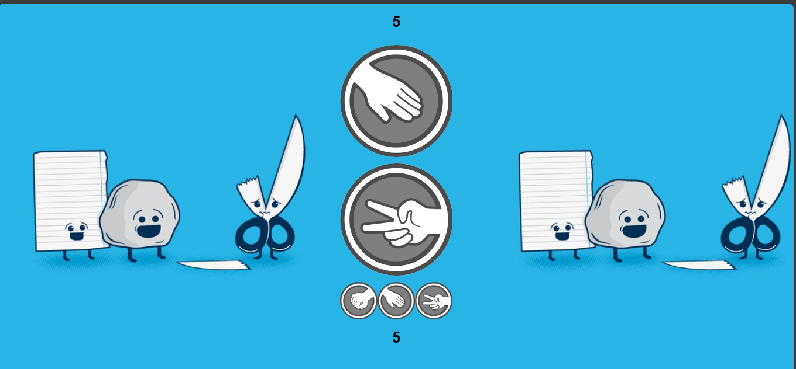

# Rock Paper Scissors Game

This is a simple Rock Paper Scissors game implemented using HTML, CSS, and JavaScript.

## How to Play

1. Open the `index.html` file in your web browser.
2. Click on one of the choices: Rock, Paper, or Scissors.
3. The opponent's choice will be randomly generated.
4. The winner of the round will be displayed, and the scores will be updated.
5. Play multiple rounds to see who wins the game!

Run Online: [Rock Paper Scissors Game](https://yash-pandey07.github.io/Rock-Paper-Scissors/)

## Features

- Single-player game against a computer opponent.
- Easy-to-use interface with clickable choices.
- Score tracking for both the player and the opponent.

## File Structure

- `index.html`: HTML file containing the game structure.
- `style.css`: CSS file for styling the game elements.
- `script.js`: JavaScript file containing the game logic.
- `background.jpg`: Background image for the game.

## Preview

## License

This project is licensed under the MIT License - see the [LICENSE](LICENSE) file for details.
